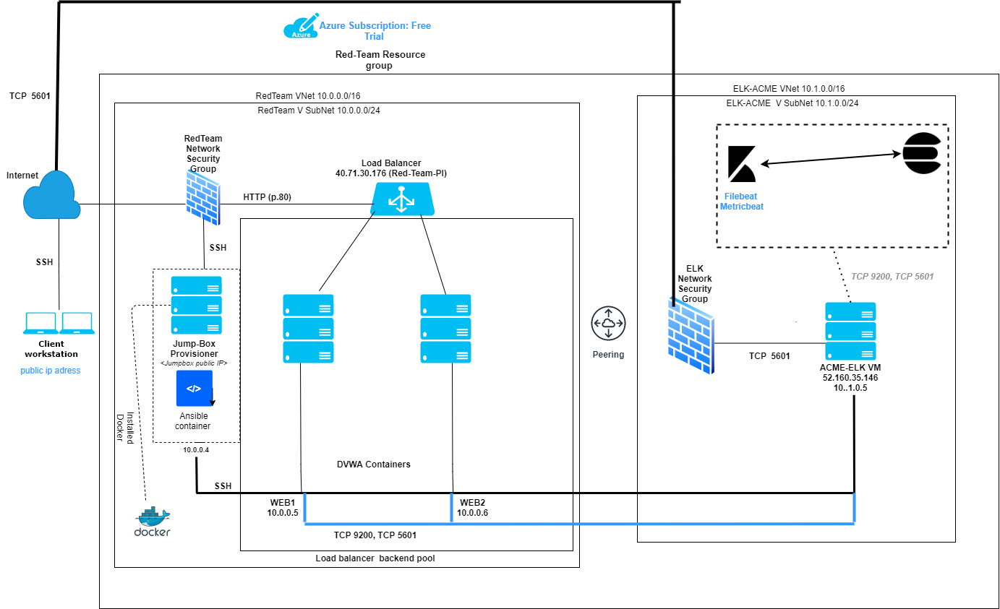
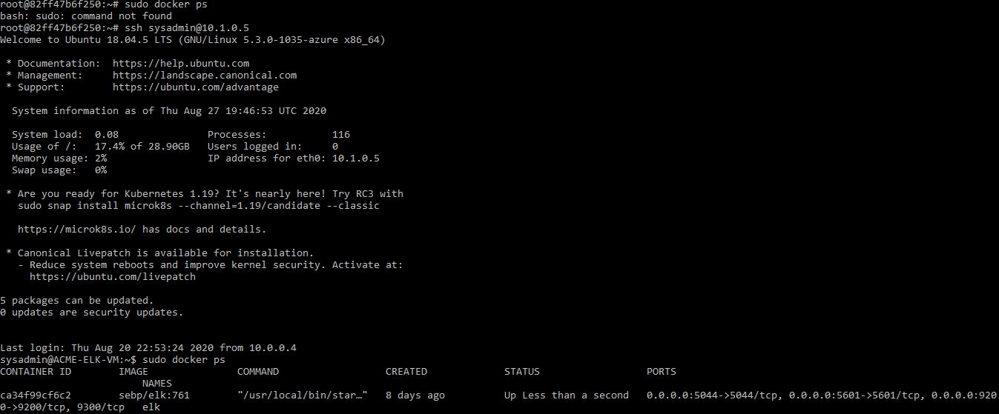

## Automated ELK Stack Deployment

The files in this repository were used to configure the network depicted below.

These files have been tested and used to generate a live ELK deployment on Azure. They can be used to either recreate the entire deployment pictured above. Alternatively, select portions of the playbook file may be used to install only certain pieces of it, such as Filebeat.

- [Ansible Playbook](https://github.com/MuzzImran/CyberSec/blob/master/Ansible/ansible_playbook.yml)
- [Ansible Hosts](https://github.com/MuzzImran/CyberSec/blob/master/Ansible/hosts)
- [Ansible Configuration](https://github.com/MuzzImran/CyberSec/blob/master/Ansible/ansible.cfg)
- [Ansible ELK Installation and VM Configuration](https://github.com/MuzzImran/CyberSec/blob/master/Ansible/install-elk.yml) 
- [Filebeat Playbook](https://github.com/MuzzImran/CyberSec/blob/master/Ansible/Filebeat/filebeat-playbook.yml)
- [Filebeat Config file](https://github.com/MuzzImran/CyberSec/blob/master/Ansible/Filebeat/filebeat-config.yml)
- [Metricbeat Playbook](https://github.com/MuzzImran/CyberSec/blob/master/Ansible/Metricbeat/metricbeats-playbook.yml)
- [Metricbeat Config file](https://github.com/MuzzImran/CyberSec/blob/master/Ansible/Metricbeat/metricbeats-config.yml)

This document contains the following details:
- Description of the Topology
- Access Policies
- ELK Configuration
  - Beats in Use
  - Machines Being Monitored
- How to Use the Ansible Build

### Description of the Topology

The main purpose of this network is to expose a load-balanced and monitored instance of DVWA, the D*mn Vulnerable Web Application.

Load balancing ensures that the application will be highly available, in addition to restricting traffic to the network.
- What aspect of security do load balancers protect? 
  Load balancers protect the availability of a service by providing access to more than one server, so if one server goes down, the other one is available providing redundancy. 

- What is the advantage of a jump box?
  The Jump box prevents other VMs in getting exposed to the public, as monitoring and logging can be done from a single box, together with a network security group we can restrict the IP addresses to communicate with the jumpbox. Jumpbox sits in front of the other VMs that are not exposed to the public internet, controlling access to other machines by allowing connections from specific IP addresses and forwarding to those machines. 

Integrating an ELK server allows users to easily monitor the vulnerable VMs for changes to the server and system application.

- Filebeat monitors specified log files and collects log events._
- Metricbeat periodically collects metrics from an operating stystem and from services running on a server. It takes the metrics and statistics it collects and ships them to specified output, such as Elasticsearch or Logstash.

The configuration details of each machine may be found below.

|   Name   |  Function | IP Address | Operating System |
|:--------:|:---------:|:----------:|:----------------:|
| Jump Box |  Gateway  |  10.0.0.4  |       Linux      |
|   Web-1  | Webserver |  10.0.0.5  |       Linux      |
|   Web-2  | Webserver |  10.0.0.6  |       Linux      |
|  ELK-VM  | Webserver |  10.1.0.5  |       Linux      |

### Access Policies

The machines on the internal network are not exposed to the public Internet. 

Only the Jump box provisioner machine can accept connections from the Internet. Access to this machine is only allowed from the following IP addresses:
- Client's Public IP 

Machines within the network can only be accessed by SSH. 
- The ELK VM can be accessed from the Ansible container on the Jump-box provisoner (40.87.103.125: 10.0.0.4)
 
A summary of the access policies in place can be found in the table below.

| Name     | Publicly Accessible | Allowed IP Addresses |
|----------|---------------------|----------------------|
| Jump Box | Yes                 |  Client's Public IP  |
|  Web 1   | No                 | 10.0.0.4 10.0.0.5 10.0.0.6 10.1.0.5       |
|  Web 2   | No                 |  10.0.0.4 10.0.0.5 10.0.0.6 10.1.0.5        |
|ELK-VM    | No                   | 10.0.0.5 10.0.0.6|  
 
### Elk Configuration

Ansible was used to automate configuration of the ELK machine. No configuration was performed manually, which is advantageous because Infrastructure as code (IaC), allows each component to be individually defined with code. So, from a security standpoint, we can quickly bring a particular piece of infrastructure up and running within a few minutes by running the code that defines the piece of infrastructure. Conversely, if the infrastructure is compromised, we can destroy it and deploy a new version within minutes. As such, we can clearly build in security protocols from the ground up.

What is the main advantage of automating configuration with Ansible? 
When done through the ansible playbook, it helps in easy configuration which is scable and able to be easily depolyed to multiple machines at the same time.

The playbook implements the following tasks:
- Specify targets using the hosts option to specify that the playbook tasks should only be run on the machines in the elk group.
- Runs sysctl -w vm.max_map_count=262144 to configure the target VM to use more memory.
- Runs shell: echo "vm.max_map_count=262144" >> /etc/sysctl.conf so that the target VM is automatically configured if the VM has been restarted.
- Install the Docker engine to run containers, and the pip package used to install Python software using the apt command.
- Downloads the Docker container called sebp/elk:761.
- Configures the container to start with the following port mappings: 5601:5601, 9200:9200, 5044:5044

The following screenshot displays the result of running `docker ps` after successfully configuring the ELK instance.
 

### Target Machines & Beats
This ELK server is configured to monitor the following machines:
- Web1, 10.0.0.5
- Web2, 10.0.0.6

We have installed the following Beats on these machines:
- Filebeat
- Metricbeat

These Beats allow us to collect the following information from each machine:
- Filebeat collects data about the filesystem, including those generated by Apache, Microsoft Azure tools, the Nginx web server, and MySQL databases. 
- Metricbeat collects data showing machine metrics and statistics shown in uptime, then ships them to the output that you specify, such as Elasticsearch or Logstash. 

### Using the Playbook
In order to use the playbook, you will need to have an Ansible control node already configured. Assuming you have such a control node provisioned: 

SSH into the control node and follow the steps below:

Copy the filebeat-playbook.yml file to /etc/ansible . this command will copy the playbook to your ElkServer.
Modify the filebeat-config.yml and metricbeat-config.yml files to include the following information that will specify on which machine to install Filebeat and Metricbeat: -In filebeat-config.yml, update Elasticsearch output "hosts" to reflect ["10.1.0.4:9200"], and input a new password for password: "changeme", if applicable. Elasticsearch output begins at line 1095/2064 of the config file. Additionally, at line 1803/2064, setup.kibana should reflect host "10.1.0.4:5601".
-Similarly, in metricbeat-config.yml, at line 61/164, update setup.kibana to reflect host: "10.1.0.4:5601". And at 93/164, udpate output.elasticsearch to reflect host: ["10.1.0.4:9200"]. If applicable, update the password.
Run the playbook, and navigate to http://:5601/app/kibana to check that the installation worked as expected. (For this deployment, we would navigate to http://13.89.241.191:5601/app/kibana to confirm.

_As a **Bonus**, provide the specific commands the user will need to run to download the playbook, update the files, etc._

- Access Jump box VM using ssh -i id_rsa sysadmin@40.87.103.125. 
- From within the Jump box VM, access the ansible container by running the following commands:
  - sudo docker container list -a (to list image Names)
  - docker start stupefied_greider
  - docker attach stupefied_greider
- Navigate to browser and enter http://40.112.191.198:5601/app/kibana (http://[your.VM.IP]:5601/app/kibana) to load the Elk Stack server. 
If kibana fails to launch, take the following steps:
  - SSH from ansible container to ElkServer (in this case, enter SSH ansibadmin@10.1.0.4).
  - Run sudo docker container list -a (this will confirm whether the Elk container is up and running.)
  - If it is not running, enter docker start elk.
  - If this was successful, the Elk Stack server (kibana webpage) should load.

To download and enable Filebeat and Metricbeat:

- Run curl command to download the Filebeat and Metricbeat config files.
For FILEBEAT: 
- Copy the  /etc/ansible/filebeat-config.yml file to  /etc/ansible/filebeat-playbook.yml
- Update the filebeat-playbook.yml file to include `curl -L -O https://artifacts.elastic.co/downloads/beats/filebeat/filebeat-7.6.1-amd64.deb`
- Run the playbook, (`ansible-playbook filebeat-playbook.yml`) and navigate to _Kibana > Logs : Add log data > System logs > 5:Module Status > Check data_ to check that the installation worked as expected. 
For METRICBEAT: 
- Copy the  /etc/ansible/metricbeats-config.yml file to  /etc/metricbeats-playbook.yml
- Update the filebeat-playbook.yml file to include `curl -L -O https://artifacts.elastic.co/downloads/beats/metricbeat/metricbeat-7.6.1-amd64.deb`
- Run the playbook, (`ansible-playbook metricbeat-playbook.yml`) and navigate to _Kibana > Add Metric Data > Docker Metrics > Module Status_ to check that the installation worked as expected
- Navigate to http://:5601/app/kibana to confirm transmission of logs and metrics data.
